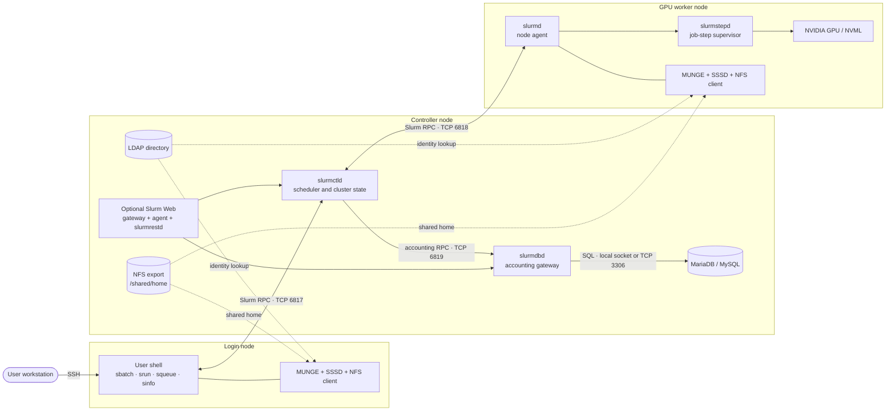
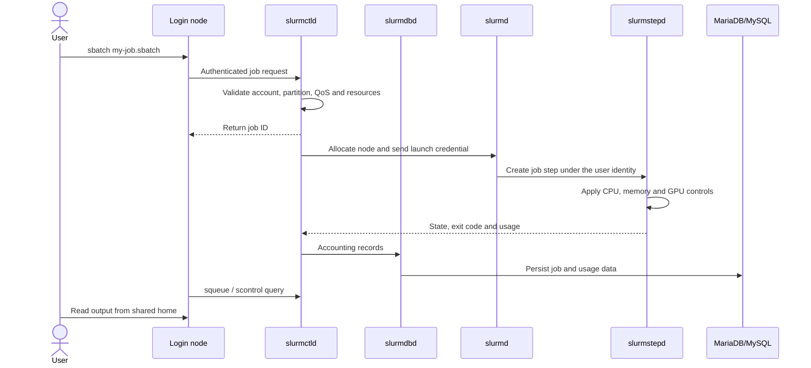
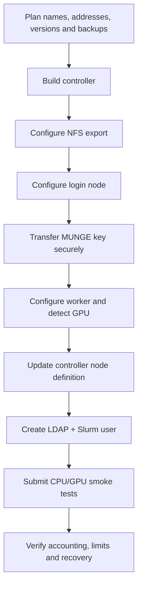

# Slurm Cluster Lab Guide

> A reusable, security-conscious lab for building a small Slurm cluster with a controller, login node, GPU worker, centralized LDAP identities, NFS shared homes, accounting, QoS policy, and an optional web interface.

[](https://slurm.schedmd.com/)
[](https://www.kernel.org/)
[](#documentation-map)
[](https://github.com/Shahariarb50/Slurm-HPC-Project-for-AI-Infra)

This repository is intended for a controlled lab or learning environment. It explains how the nodes and services fit together, which script runs where, how a job moves through the cluster, and how to validate and troubleshoot the finished installation.

No real IP address, username, password, domain, or private key should be committed. Replace every value enclosed in angle brackets, such as `<controller-ip>`, before use.

> [!WARNING]
> Review every script before running it with `sudo`. The setup changes authentication, firewall-sensitive services, shared storage, databases, and scheduler configuration. Take snapshots or backups first. The examples are a starting point, not a substitute for your organization's security policy.

## Table of contents

- [What this lab builds](#what-this-lab-builds)
- [Architecture](#architecture)
- [How the components communicate](#how-the-components-communicate)
- [How a job moves through the cluster](#how-a-job-moves-through-the-cluster)
- [Node and service responsibilities](#node-and-service-responsibilities)
- [Requirements and planning](#requirements-and-planning)
- [Documentation map](#documentation-map)
- [Installation workflow](#installation-workflow)
- [LDAP identities and shared homes](#ldap-identities-and-shared-homes)
- [Roles and authorization](#roles-and-authorization)
- [Accounting and QoS](#accounting-and-qos)
- [Submitting and monitoring jobs](#submitting-and-monitoring-jobs)
- [GPU scheduling](#gpu-scheduling)
- [Reservations and administration](#reservations-and-administration)
- [Validation checklist](#validation-checklist)
- [Operations, backup, and recovery](#operations-backup-and-recovery)
- [Troubleshooting](#troubleshooting)
- [Security and production hardening](#security-and-production-hardening)
- [Official references](#official-references)

## What this lab builds

The reference deployment uses three logical nodes. Several roles are colocated on the controller to keep the lab small.

| Node | Main services | Purpose |
|---|---|---|
| Controller | `slurmctld`, `slurmdbd`, MariaDB/MySQL, LDAP, NFS, optional `slurmrestd` and Slurm Web | Maintains cluster state, schedules jobs, stores accounting data, serves identities and shared homes |
| Login node | Slurm client commands, MUNGE, SSSD, NFS client, SSH | Gives users a controlled place to edit files, compile code, and submit or monitor jobs |
| Worker node | `slurmd`, `slurmstepd`, MUNGE, SSSD, NFS client, optional NVIDIA stack | Executes the CPU/GPU work allocated by Slurm |

The same model can be expanded to multiple login and worker nodes. In a production environment, LDAP, SQL, NFS, Slurm Web, and the backup controller are commonly separated onto dedicated or highly available systems.

### Included capabilities

- Central scheduling and resource allocation with Slurm.
- CPU, memory, runtime, job-count, and GPU controls through partitions and QoS.
- Central users and groups through LDAP with SSSD on client nodes.
- Consistent home directories through NFS at `/shared/home`.
- Job accounting through `slurmdbd` and MariaDB/MySQL.
- Optional Slurm REST/Web services.
- User creation, role management, safe deletion, job submission, and administrator utilities.

### Non-goals

- A fully supported production deployment.
- Internet-facing Slurm REST or LDAP services.
- High-availability storage, database, or identity infrastructure.
- Container orchestration, parallel filesystem design, or automated image provisioning.
- Strict fractional GPU memory isolation on hardware without MIG support.

## Architecture

GitHub renders the following Mermaid block as a graphical diagram.



### Trust and data planes

The cluster has several overlapping communication paths:

1. **Control plane:** client commands and daemons exchange Slurm RPC messages.
2. **Identity plane:** SSSD queries LDAP so the same username maps to the same UID and GID everywhere.
3. **Authentication plane:** MUNGE signs short-lived credentials used by Slurm components.
4. **Storage plane:** NFS exposes the same home directory on login and worker nodes.
5. **Accounting plane:** `slurmctld` sends records to `slurmdbd`, which reads from and writes to SQL.
6. **Web/API plane:** Slurm Web communicates through its gateway/agent and `slurmrestd`; this path must remain protected behind trusted access controls.

## How the components communicate

| Source | Destination | Default or typical path | What travels over it |
|---|---|---|---|
| Login/client commands | `slurmctld` | TCP 6817 by default | Submit, query, update, and cancel requests |
| `slurmctld` | Worker `slurmd` | TCP 6818 by default | Node registration, allocation, launch, signal, and status RPCs |
| `slurmctld` / accounting clients | `slurmdbd` | TCP 6819 by default | Job/account/QoS/association accounting operations |
| `slurmdbd` | MariaDB/MySQL | Local socket or TCP 3306 in this lab | Persistent accounting and policy data |
| Login and worker | LDAP | Site-configured LDAP/LDAPS port | User, group, UID, and GID lookup through SSSD |
| Login and worker | NFS server | NFSv4 commonly uses TCP 2049 | Shared user home files |
| Slurm processes | Local `munged` | Local UNIX socket | Credential creation and verification |

These are defaults or common values, not universal firewall rules. The actual values in `slurm.conf`, `slurmdbd.conf`, LDAP, NFS, and the web stack are authoritative. Slurm requires bidirectional IP connectivity for the relevant hosts and additional dynamic ports may be needed for some `srun` and MPI patterns.

> [!NOTE]
> MUNGE does not route messages between nodes. It creates and verifies credentials. Every participating host must have a compatible MUNGE installation, synchronized time, and the same protected key where required by the selected topology.

## How a job moves through the cluster



In plain language:

1. The user runs `sbatch`, `srun`, `squeue`, or another client command on the login node.
2. MUNGE-backed authentication allows the Slurm service to verify the request identity.
3. `slurmctld` checks the requested partition, account, QoS, limits, dependencies, and resources.
4. A pending job waits until a compatible worker has enough free CPU, RAM, and GPU resources.
5. `slurmctld` instructs `slurmd` on the selected worker to launch the allocation.
6. `slurmd` starts a `slurmstepd` process for each job step. `slurmstepd` applies the job environment and resource controls and supervises the workload.
7. Completion state and usage return to the controller. Accounting records travel through `slurmdbd` into SQL.
8. The user's output remains available through the shared home directory.

## Node and service responsibilities

### Controller node

`slurmctld` is the authority for live cluster state. It tracks nodes, partitions, reservations, jobs, and allocations and runs the scheduler and selection plugins. Its `StateSaveLocation` stores recoverable controller state; this is different from historical accounting data in SQL.

In this lab the controller also hosts:

- `slurmdbd` as the authenticated accounting and policy gateway;
- MariaDB/MySQL as persistent storage;
- LDAP as the identity source;
- NFS as the shared-home server;
- optional REST and web components.

Colocation reduces VM count but increases the controller's failure impact. Monitor disk space, memory pressure, database health, NFS availability, and service startup order.

### Login node

The login node is the normal user entry point. It should be used for source editing, small compilations, data preparation, job submission, and monitoring. It should not become an unmanaged compute node. Apply SSH policy and process limits appropriate to the lab.

### Worker node

`slurmd` reports hardware and node state, accepts valid allocations, launches `slurmstepd`, and reports health and job status. It normally runs with the privileges needed to establish the target user's job environment. Users should not need direct SSH access to it.

### `slurmstepd`

`slurmstepd` is created locally for an allocated job step. It handles the user identity, environment, standard I/O, CPU binding, cgroups, device access, signals, exit codes, and usage collection. It exits when the step ends.

### LDAP and SSSD

LDAP stores the central identity records. SSSD on login and worker nodes resolves those records and caches them. Slurm does not replace operating-system identity resolution: if the worker cannot resolve the user, a correctly scheduled job can still fail at launch.

### NFS shared home

The controller exports `/shared/home`; login and worker nodes mount it at the same path. This lets a script submitted from the login node find the same code and write output to the same home on the worker.

## Requirements and planning

### Supported environment assumptions

- Linux hosts with `systemd` and administrative access.
- Working forward and reverse name resolution, or consistent `/etc/hosts` entries.
- Stable IP connectivity between all participating nodes.
- Synchronized clocks using Chrony, systemd-timesyncd, or an equivalent service.
- The same Slurm release and compatible plugin set across controller, login, and worker nodes.
- A supported MariaDB/MySQL installation for accounting.
- NVIDIA driver and NVML support on GPU workers when GPU auto-detection is used.

Pin exact OS, Slurm, database, LDAP, SSSD, NVIDIA driver, CUDA, and Slurm Web versions in release notes or a deployment manifest. Do not assume package names or service behavior are identical across distributions.

### Capacity guidance for a small lab

| Node | Suggested starting point | Notes |
|---|---|---|
| Controller | 2–4 vCPU, 4–8 GB RAM, durable disk | Increase resources when SQL, LDAP, NFS, and web services share the host |
| Login | 2 vCPU, 2–4 GB RAM | Limit interactive resource use |
| Worker | Workload-dependent CPU/RAM plus GPU | Leave RAM for the OS; configure Slurm `RealMemory` conservatively |

These are not performance guarantees. Measure the real workload and scale accordingly.

### Deployment worksheet

Complete this before running scripts:

| Setting | Example placeholder | Your value |
|---|---|---|
| Cluster name | `<cluster-name>` | |
| Controller hostname/IP | `<controller-host>` / `<controller-ip>` | |
| Login hostname/IP | `<login-host>` / `<login-ip>` | |
| Worker hostname/IP | `<worker-host>` / `<worker-ip>` | |
| Partition | `<partition>` | |
| LDAP base DN | `dc=<example>,dc=<org>` | |
| LDAP organization | `<organization>` | |
| Shared home | `/shared/home` | |
| Allowed NFS clients | `<client-ip-or-cidr>` | |
| SQL database/user | `<database>` / `<db-user>` | |
| Slurm version | `<version>` | |

### Placeholder and secret policy

- Replace all `<...>` values before execution.
- Never commit passwords, bind credentials, JWTs, MUNGE keys, private keys, or a completed secret worksheet.
- Use a password manager or secret-management system.
- Confirm file ownership and mode after copying secrets.
- Prefer SSH/SCP or another encrypted administrative channel for key transfer.

## Documentation map

| Script | Run on | Purpose |
|---|---|---|
| [`setup-slurm-web-controller-dynamic.sh`](setup-slurm-web-controller-dynamic.sh) | Controller | Fresh controller installation: Slurm, accounting database, LDAP, and web components |
| [`setup_shared_home_controller_dynamic.sh`](setup_shared_home_controller_dynamic.sh) | Controller | Creates the NFS server and exports `/shared/home` |
| [`setup-login-node-dynamic.sh`](setup-login-node-dynamic.sh) | Login node | Installs Slurm client components, MUNGE, and initial LDAP login support |
| [`setup_ldap_identity_client_dynamic.sh`](setup_ldap_identity_client_dynamic.sh) | Login and worker | Configures LDAP/SSSD identity resolution |
| [`setup_shared_home_login_dynamic.sh`](setup_shared_home_login_dynamic.sh) | Login node | Mounts the shared home persistently |
| [`setup-worker-node-gpu-dynamic.sh`](setup-worker-node-gpu-dynamic.sh) | Worker | Configures `slurmd` and NVIDIA GPU auto-detection |
| [`setup_shared_home_worker_dynamic.sh`](setup_shared_home_worker_dynamic.sh) | Worker | Mounts the shared home persistently |
| [`create_ldap_slurm_user_dynamic.sh`](create_ldap_slurm_user_dynamic.sh) | Controller | Creates an LDAP user, private home, Slurm account, association, and QoS membership |
| [`manage_ldap_slurm_users_groups_dynamic.sh`](manage_ldap_slurm_users_groups_dynamic.sh) | Controller | Edits or deletes users and manages LDAP groups |
| [`submit_slurm_job_dynamic.sh`](submit_slurm_job_dynamic.sh) | Login, as a normal user | Generates and submits a Slurm batch job |
| [`slurm_superadmin_menu.sh`](slurm_superadmin_menu.sh) | Controller | Interactive job, reservation, and QoS administration |

If your repository does not contain one of these scripts yet, remove its row or add the script before publishing. A README should not promise files that are absent from the repository.

### Get the project

```bash
git clone https://github.com/Shahariarb50/Slurm-HPC-Project-for-AI-Infra.git
cd Slurm-HPC-Project-for-AI-Infra
```

Read [`PASSWORD_PROMPTS.md`](PASSWORD_PROMPTS.md) before installation so you know which prompts contain credentials and which values must remain private.

### Before running scripts copied from Windows

Shell scripts require Unix LF line endings:

```bash
sed -i 's/\r$//' <script>.sh
chmod +x <script>.sh
```

This prevents errors such as `/usr/bin/env: 'bash\r': No such file or directory`.

Inspect each script before execution:

```bash
less <script>.sh
bash -n <script>.sh
```

## Installation workflow



### 1. Prepare every host

Before installing services:

```bash
hostnamectl
getent hosts <controller-host>
getent hosts <login-host>
getent hosts <worker-host>
timedatectl status
```

Confirm hostname consistency, DNS or `/etc/hosts`, routing, time synchronization, repository access, and firewall ownership. Take a VM snapshot or system backup.

### 2. Build the controller

Run the full controller script only on a new or intentionally rebuilt controller:

```bash
sudo bash setup-slurm-web-controller-dynamic.sh
```

During setup, define the cluster name, LDAP domain and organization, partition name, SQL credentials, and administrator credentials. Record non-secret choices in your deployment worksheet.

Check essential services after completion:

```bash
sudo systemctl is-active munge mariadb slapd slurmdbd slurmctld
scontrol ping
sinfo
```

If the web stack is enabled, also verify the service names installed by that stack:

```bash
sudo systemctl is-active slurmrestd slurm-web-agent slurm-web-gateway
```

Do not continue until `slurmctld` can start without configuration, permission, DNS, or authentication errors.

### 3. Configure the NFS shared home

On the controller:

```bash
sudo bash setup_shared_home_controller_dynamic.sh
sudo exportfs -v
systemctl is-active nfs-server
```

Use `/shared/home` consistently and allow only the exact client IPs or intended routed subnets. The parent directories must be traversable:

```bash
sudo chmod 755 /shared /shared/home
```

Keep individual home directories private, normally mode `700`, with ownership matching the LDAP UID and primary GID.

### 4. Configure the login node

```bash
sudo bash setup-login-node-dynamic.sh
sudo bash setup_ldap_identity_client_dynamic.sh
sudo bash setup_shared_home_login_dynamic.sh
```

Use the controller hostname or IP where the scripts request Slurm, LDAP, and NFS endpoints. Verify:

```bash
getent passwd <ldap-user>
id <ldap-user>
findmnt /shared/home
scontrol ping
sinfo
systemctl is-active munge sssd
```

### 5. Transfer the MUNGE key securely

The required Slurm hosts must use the intended MUNGE trust domain. Transfer the key through an encrypted administrative channel; never put it in Git.

On a destination host, after a secure copy to `/tmp/munge.key`:

```bash
sudo install -o munge -g munge -m 0400 /tmp/munge.key /etc/munge/munge.key
sudo rm -f /tmp/munge.key
sudo systemctl restart munge
```

Validate local and cross-host authentication:

```bash
munge -n | unmunge
munge -n | ssh <worker-host> unmunge
```

If the second command fails, check key equality, ownership, mode, clock synchronization, DNS, SSH routing, and `munged` status.

### 6. Configure the GPU worker

```bash
sudo bash setup-worker-node-gpu-dynamic.sh
sudo bash setup_ldap_identity_client_dynamic.sh
sudo bash setup_shared_home_worker_dynamic.sh
```

Validate the operating-system view first:

```bash
getent passwd <ldap-user>
findmnt /shared/home
nvidia-smi -L
systemctl is-active munge sssd
```

For NVML-backed GPU discovery, the expected worker configuration is:

```ini
# /etc/slurm/gres.conf
AutoDetect=nvml
```

Ask `slurmd` to print what it detects:

```bash
sudo slurmd -C
sudo slurmd -G
```

Use the detected CPU, socket, core, thread, memory, and GRES information to create the worker's `NodeName=...` definition in the controller's `slurm.conf`. Ensure the cluster configuration also contains:

```ini
GresTypes=gpu
```

Then reconfigure and start or resume the node:

```bash
sudo scontrol reconfigure
sudo systemctl restart slurmd
sudo scontrol update NodeName=<worker-name> State=RESUME
sinfo -N -o '%N %T %C %m %G'
```

Do not copy a hardware line from another worker. A mismatch between configured and detected resources can drain the node.

### 7. Create the first user

On the controller:

```bash
sudo bash create_ldap_slurm_user_dynamic.sh
```

The intended workflow creates:

1. an LDAP user and private group;
2. `/shared/home/<username>` with matching ownership;
3. a Slurm account and user association;
4. partition and QoS access;
5. membership in the normal-user role group.

Verify all three identity layers:

```bash
getent passwd <username>
id <username>
sudo sacctmgr show user <username> withassoc \
  format=User,Account,Partition,DefaultAccount,AdminLevel,DefaultQOS
```

Repeat `getent` and `id` on the login and worker nodes. Do not proceed if UID or GID differs.

## LDAP identities and shared homes

Every host that accepts an LDAP user or launches a job for that user must resolve the same identity. LDAP provides the central record; SSSD provides client resolution and caching.

Expected home path:

```text
/shared/home/<username>
```

Test from the login node as the normal user:

```bash
pwd
id
touch ~/shared-home-test.txt
stat ~/shared-home-test.txt
rm ~/shared-home-test.txt
findmnt /shared/home
```

Then submit a job that runs `id`, `hostname`, and `stat "$HOME"`. That validates identity and storage inside a real allocation, not just at the login shell.

If cached identity data becomes stale after an intentional directory change:

```bash
sudo systemctl restart sssd
getent passwd <username>
```

Use cache invalidation carefully in production because it can temporarily affect login and job launches.

## Roles and authorization

Use LDAP group names that do not conflict with operating-system groups:

| Role | LDAP group | Intended access |
|---|---|---|
| User | `slurm-users` | SSH to the login node and normal job submission |
| Admin | `slurm-admins` | Delegated operational access defined by local policy |
| Super Admin | `slurm-superadmins` | Slurm administration and the web administrator role |

LDAP group membership, Linux `sudo`, Slurm account associations, QoS, and Slurm `AdminLevel` are separate authorization systems. A Super Admin who must control Slurm also needs the correct Slurm `AdminLevel`, and any shell privilege must be granted through an audited `sudoers` policy.

Normal users should not SSH directly to workers. Use SSH configuration, firewall policy, and access-control rules to enforce the login-node boundary. Slurm should allocate worker resources.

### Editing and deleting users

On the controller:

```bash
sudo bash manage_ldap_slurm_users_groups_dynamic.sh
```

The menu is expected to support:

1. editing a full name, password, QoS, or role;
2. safely deleting a user;
3. creating or deleting custom LDAP groups;
4. adding or removing group membership;
5. listing users and groups.

A safe deletion workflow should require exact confirmation, remove directory and Slurm associations, remove role memberships, and move the home to `/shared/home-archive/` rather than immediately erasing it. Confirm the archive filesystem has enough capacity and define a retention policy.

## Accounting and QoS

`slurmdbd` is the supported gateway between Slurm services and the accounting database. Compute nodes do not log in to MariaDB/MySQL. Live node and queue state belongs primarily to `slurmctld`; SQL stores historical jobs, associations, limits, and usage.

Confirm cluster registration and accounting:

```bash
sudo sacctmgr show cluster
sudo sacctmgr show account
sudo sacctmgr show user withassoc
sacct -S today
```

### Example normal-user QoS

```bash
sudo sacctmgr -i modify qos normal set \
  MaxTRESPerUser=cpu=2,mem=1G \
  MaxWall=02:00:00 \
  MaxJobsPerUser=1
```

Review the result:

```bash
sudo sacctmgr show qos \
  format=Name,Priority,MaxWall,MaxTRESPerUser,MaxJobsPU
```

QoS alone does nothing until the relevant user/account association can use it and the enforcement configuration matches the intended policy. Test both an allowed job and a deliberately over-limit job.

> [!IMPORTANT]
> Do not promise an “unlimited” administrator QoS without understanding partition limits, associations, fair-share behavior, TRES definitions, and site policy. Administrative privilege and scheduler resource policy are different concerns.

## Submitting and monitoring jobs

Normal users connect only to the login node:

```bash
ssh <username>@<login-node>
```

Use the helper:

```bash
chmod +x submit_slurm_job_dynamic.sh
./submit_slurm_job_dynamic.sh
```

Or submit a batch file directly:

```bash
sbatch ~/my-job.sbatch
```

### CPU smoke test

```bash
#!/usr/bin/env bash
#SBATCH --job-name=cpu-smoke
#SBATCH --partition=<partition>
#SBATCH --account=<account>
#SBATCH --cpus-per-task=1
#SBATCH --mem=512M
#SBATCH --time=00:05:00
#SBATCH --output=%x-%j.out
#SBATCH --error=%x-%j.err

set -euo pipefail
hostname
id
echo "SLURM_JOB_ID=${SLURM_JOB_ID}"
echo "SLURM_CPUS_PER_TASK=${SLURM_CPUS_PER_TASK}"
```

### GPU smoke test

```bash
#!/usr/bin/env bash
#SBATCH --job-name=gpu-smoke
#SBATCH --partition=<partition>
#SBATCH --account=<account>
#SBATCH --cpus-per-task=2
#SBATCH --mem=1G
#SBATCH --gres=gpu:1
#SBATCH --time=00:10:00
#SBATCH --output=%x-%j.out
#SBATCH --error=%x-%j.err

set -euo pipefail
hostname
echo "CUDA_VISIBLE_DEVICES=${CUDA_VISIBLE_DEVICES:-unset}"
nvidia-smi -L
nvidia-smi
```

Replace the smoke-test command with the real workload, for example `python train.py`, only after the cluster checks pass.

### Monitoring commands

```bash
squeue -u "$USER"
sinfo -N -l
scontrol show job <job-id>
sstat -j <job-id>.batch
sacct -j <job-id> \
  --format=JobID,JobName,State,ExitCode,Elapsed,AllocCPUS,ReqMem,AllocTRES
```

Cancel your own job:

```bash
scancel <job-id>
```

Common states:

| State | Meaning |
|---|---|
| `PD` | Pending; inspect `squeue -j <job-id> -o '%.18i %.2t %R'` for the reason |
| `R` | Running |
| `CG` | Completing; cleanup is still in progress |
| `CD` | Completed successfully |
| `F` | Failed |
| `CA` | Cancelled |
| `TO` | Timed out |
| `OOM` | Exceeded the enforced memory allocation |

## GPU scheduling

Slurm treats GPUs as Generic Resources (GRES). The worker detects physical devices; the controller schedules only what is defined and registered.

Validate each layer in this order:

1. `nvidia-smi -L` shows the physical GPU.
2. `slurmd -G` parses `gres.conf` and reports the devices.
3. `sinfo -N -o '%N %T %G'` shows the registered GRES.
4. `scontrol show node <worker-name>` shows configured and allocated TRES/GRES.
5. A scheduled GPU smoke test sees only the device assigned by Slurm.

An RTX-class GPU without NVIDIA MIG support is normally one allocatable GPU:

```bash
#SBATCH --gres=gpu:1
```

MPS can share GPU compute, but it does not provide a strict per-user VRAM limit. Do not invent fake GPU slices. For predictable isolation, allocate whole GPUs or use supported MIG-capable hardware and an intentionally designed configuration.

Memory requests must also fit the worker's Slurm-configured `RealMemory`. Leave headroom for the OS and daemons.

## Reservations and administration

Slurm Web may be view-only depending on the deployment and role mapping. Run privileged operational actions on the controller through an audited administrative path.

```bash
sudo bash slurm_superadmin_menu.sh
```

The helper may list active jobs, cancel one job, cancel jobs for a user, create/delete reservations, and inspect QoS. Destructive actions should require explicit typed confirmation.

Manual reservation example:

```bash
sudo scontrol create reservation \
  ReservationName=<name> \
  StartTime=<YYYY-MM-DDTHH:MM:SS> \
  EndTime=<YYYY-MM-DDTHH:MM:SS> \
  Users=<username> \
  Nodes=<worker-name> \
  TRES=cpu=2,mem=1G,gres/gpu=1 \
  Flags=PART_NODES
```

Verify or delete:

```bash
scontrol show reservation <name>
sudo scontrol delete ReservationName=<name>
```

## Validation checklist

A setup is not complete merely because every installer exited successfully.

### Controller

- [ ] `scontrol ping` reports the primary controller responding.
- [ ] `sinfo -N -l` shows the expected worker and state.
- [ ] MUNGE, SQL, LDAP, NFS, `slurmdbd`, and `slurmctld` are active.
- [ ] `sacctmgr show cluster` lists the intended cluster.
- [ ] `exportfs -v` contains only intended NFS clients.
- [ ] Logs contain no recurring authentication, registration, or SQL errors.

### Login node

- [ ] LDAP user resolves with the correct UID/GID.
- [ ] `/shared/home` is mounted at the expected path.
- [ ] The user can create and remove a file in their own home.
- [ ] `sinfo`, `squeue`, and `sbatch` reach the controller.
- [ ] Normal users cannot obtain unintended administrative access.

### Worker

- [ ] LDAP user resolves with the same UID/GID as the login node.
- [ ] `/shared/home` is mounted.
- [ ] `slurmd` is active and the node is not unexpectedly drained.
- [ ] `slurmd -G` reports the expected GPU resources.
- [ ] A CPU job and GPU job finish successfully.
- [ ] Job output is visible from the login node.

### Policy and accounting

- [ ] An allowed job starts.
- [ ] An over-limit CPU, memory, time, concurrency, or GPU request is rejected or remains pending for the expected reason.
- [ ] `sacct` shows the completed job, state, exit code, and allocation.
- [ ] Normal users cannot cancel other users' jobs.
- [ ] The administrator recovery and backup procedure has been tested.

## Operations, backup, and recovery

### Daily health checks

Controller:

```bash
scontrol ping
sinfo -N -l
squeue
sudo exportfs -v
sudo systemctl is-active \
  munge slapd nfs-server mariadb slurmdbd slurmctld
```

Login:

```bash
getent passwd <username>
findmnt /shared/home
sinfo
systemctl is-active munge sssd
```

Worker:

```bash
getent passwd <username>
findmnt /shared/home
systemctl is-active munge slurmd sssd
nvidia-smi -L
slurmd -G
```

### Backup scope

Back up at least:

- Slurm configuration, controller state directory, and service overrides;
- `slurmdbd.conf` and the accounting database through a database-consistent method;
- LDAP configuration and directory data through an LDAP-aware backup method;
- `/etc/exports` and user home data;
- MUNGE key through an encrypted, tightly restricted secret backup;
- SSSD and web/reverse-proxy configuration, excluding disposable caches;
- a version manifest for the OS, Slurm, plugins, database, LDAP, GPU driver, and CUDA.

Do not publish those backups in Git. Test restoration on an isolated system. A backup that has never been restored is only an assumption.

### Failure expectations

| Failure | Immediate impact | Recovery focus |
|---|---|---|
| `slurmctld` down | New submissions, scheduling, and control requests stop | Restore controller state or activate a tested backup controller |
| Worker `slurmd` down | Node stops reporting and jobs on it may fail | Fix host, MUNGE, networking, or daemon; resume only after validation |
| `slurmdbd` down | Accounting and association service is unavailable | Restore service; inspect controller caching/backlog and logs |
| SQL down | `slurmdbd` cannot persist or query data | Restore the database and verify consistency |
| LDAP/SSSD failure | Login or job identity resolution may fail | Restore directory/client service and verify UID/GID consistency |
| NFS failure | Home files and job I/O become unavailable | Restore export/mount and check for application I/O impact |
| MUNGE mismatch or clock skew | Credential validation fails | Restore the correct key, permissions, and synchronized time |

## Troubleshooting

Start at the failing connection and check both ends: configuration, name resolution, route, firewall, service state, authentication, and logs.

| Symptom | Likely area | Checks and resolution |
|---|---|---|
| `bash\r` or `bash^M` error | Windows line endings | Run `sed -i 's/\r$//' <script>.sh`, then `bash -n <script>.sh` |
| Controller does not respond | `slurmctld`, config, DNS, firewall | `scontrol ping`; inspect `systemctl status slurmctld` and controller logs |
| Worker absent from `sinfo` | MUNGE, DNS, TCP 6817/6818, node definition | Compare `slurmd -C` with `slurm.conf`; inspect both daemon logs |
| Worker is `DOWN` or `DRAIN` | Hardware/config mismatch or health error | `scontrol show node <node>` and inspect `Reason=` before resuming |
| User resolves on login, not worker | LDAP/SSSD client | `getent passwd`, `sssctl`, SSSD logs, LDAP reachability and TLS trust |
| User cannot enter home | NFS, permissions, UID/GID | `findmnt`, `exportfs -v`, `namei -l`, `id`, ownership and mode |
| NFS mount fails | Export allow-list, routing, firewall | Validate exact client IP/CIDR, NFS version, ports, and server logs |
| `Invalid account or account/partition combination` | Slurm associations | Inspect `sacctmgr show user ... withassoc` and partition access |
| Job pending with `QOS...Limit` | QoS or association limits | Inspect pending reason and `sacctmgr show qos` |
| Requested node configuration unavailable | CPU/RAM/GPU request | Compare job request with `sinfo`, `scontrol show node`, partition, and QoS |
| GPU missing | Driver/NVML/GRES configuration | Run `nvidia-smi -L`, `slurmd -G`; inspect `gres.conf` and Slurm build plugins |
| Job fails at launch | Identity, home, prolog, cgroup, environment | Inspect job, controller, `slurmd`, and step logs; test `id` inside allocation |
| Completed job missing from `squeue` | Normal queue behavior | `squeue` is for active/pending jobs; use `sacct` for history |
| Job absent from active web view | Job completed quickly or API/accounting issue | Check history/accounting, `slurmrestd`, gateway/agent, and proxy logs |

Useful diagnostic bundle:

```bash
scontrol ping
sinfo -Nel
squeue -o '%.18i %.9P %.16j %.8u %.2t %.10M %.6D %R'
scontrol show config | egrep 'ClusterName|SlurmctldHost|SlurmctldPort|SlurmdPort|AccountingStorage'
scontrol show node <worker-name>
sudo journalctl -u slurmctld -u slurmdbd --since '1 hour ago'
sudo journalctl -u slurmd -u munge -u sssd --since '1 hour ago'
```

Test configured default ports only where applicable:

```bash
nc -vz <controller-host> 6817
nc -vz <worker-host> 6818
nc -vz <slurmdbd-host> 6819
```

Do not expose SQL port 3306 to workers merely to make a connectivity test pass. In this reference topology only `slurmdbd` needs SQL access.

## Security and production hardening

- Separate controller SSH, SQL, LDAP administrator, service-account, and normal-user credentials.
- Protect the MUNGE key as a cluster secret; do not share it with users or commit it.
- Use LDAPS/StartTLS and a least-privilege read-only LDAP bind account for clients.
- Restrict LDAP administration and SQL access to management paths.
- Place Slurm Web and REST behind strong authentication, authorization, rate limits, monitoring, and TLS appropriate to the installed Slurm/Web versions.
- Do not expose `slurmrestd` directly to the public internet.
- Restrict NFS exports to exact required clients or subnets; understand root-squash and identity implications.
- Disable normal-user SSH to workers and protect the controller with administrative access controls.
- Use narrowly scoped `sudoers` rules instead of broad passwordless root access.
- Keep Slurm components and plugins version-aligned and follow supported upgrade paths.
- Centralize logs, alert on failed daemons and disk pressure, and audit administrator actions.
- Patch the OS, Slurm, database, directory service, web stack, NVIDIA driver, and dependencies.
- Separate controller, SQL, LDAP, NFS, and web roles and add high availability when the service-level objective requires it.

> [!CAUTION]
> The REST API is powerful enough to control cluster resources. Follow the security documentation for your exact Slurm version. Do not assume an older reverse-proxy example is safe for current production use.

## Repository hygiene

The repository currently uses a simple flat layout:

```text
.
├── README.md
├── PASSWORD_PROMPTS.md
├── setup-slurm-web-controller-dynamic.sh
├── setup_shared_home_controller_dynamic.sh
├── setup-login-node-dynamic.sh
├── setup_ldap_identity_client_dynamic.sh
├── setup_shared_home_login_dynamic.sh
├── setup-worker-node-gpu-dynamic.sh
├── setup_shared_home_worker_dynamic.sh
├── create_ldap_slurm_user_dynamic.sh
├── manage_ldap_slurm_users_groups_dynamic.sh
├── submit_slurm_job_dynamic.sh
└── slurm_superadmin_menu.sh
```

If the project grows, consider grouping scripts by node role and moving smoke-test jobs into `examples/`. Such a move should update every README link and deployment command in the same commit.

Before publishing, check the repository for secrets and environment-specific values:

```bash
git status
git diff --check
git grep -nE '(password|secret|token|private.key|munge.key)' -- ':!README.md'
```

Review every match manually; the command is a hint, not a complete secret scanner. Add a license and document the supported operating system and exact release combinations.

## Official references

- [Slurm overview](https://slurm.schedmd.com/overview.html)
- [Quick Start Administrator Guide](https://slurm.schedmd.com/quickstart_admin.html)
- [Network Configuration Guide](https://slurm.schedmd.com/network.html)
- [Authentication plugins and MUNGE](https://slurm.schedmd.com/authentication.html)
- [Generic Resources (GRES)](https://slurm.schedmd.com/gres.html)
- [Accounting and resource limits](https://slurm.schedmd.com/resource_limits.html)
- [`slurm.conf` reference](https://slurm.schedmd.com/slurm.conf.html)
- [`slurmdbd.conf` reference](https://slurm.schedmd.com/slurmdbd.conf.html)
- [`slurmrestd` reference](https://slurm.schedmd.com/slurmrestd.html)
- [Slurm REST API security and behavior](https://slurm.schedmd.com/rest.html)
- [Slurm troubleshooting guide](https://slurm.schedmd.com/troubleshoot.html)

## Contribution notes

When changing a setup script:

1. update the script table and its run location;
2. document new prompts, files, ports, and services;
3. validate shell syntax with `bash -n` and, where available, ShellCheck;
4. test on fresh disposable nodes and test repeat execution where idempotency is claimed;
5. remove secrets, machine-specific values, logs, and generated credentials;
6. update the validation and rollback steps.

Issues and pull requests should include the OS release, Slurm release, affected node role, exact command, relevant redacted logs, expected behavior, and observed behavior.

---

This guide intentionally uses placeholders and conservative defaults. The installed configuration and the official documentation for the deployed Slurm release remain authoritative.
